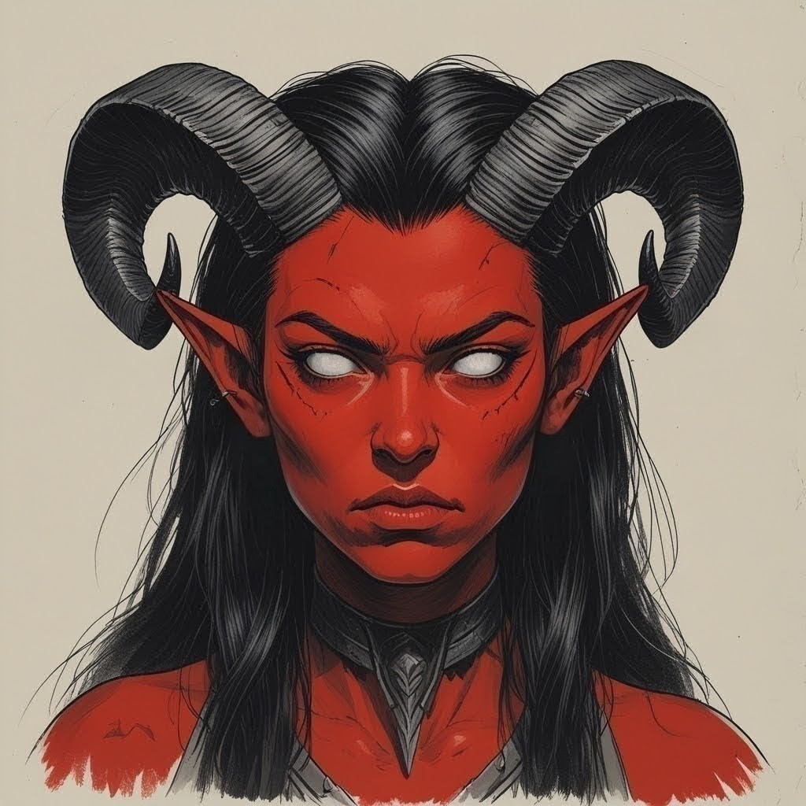

**Name**: Akta Cheshko
**Race** : Variant Tiefling - Bloodline of Orcus
**Class** : Warlock
**Age**: 28 ans
**Gender**: Female
**Alignment**: chaotic neutral 
## **Appearance**: 
- tall and slender. Quite pretty in the eyes of other Tieflings. 
- 176 cm in height with a 131cm tail which lash or coils around her legs when she gets upset or nervous, for a total of 77kg. 
- Dark crimson red smooth skin with jet black hairs and silver eyes like a full moon
- A proud and severe face whose smile reveals a forked tongue behind sharp teeth
- Well-sized ram horns, starting joined at the forehead and curving above and behind the ears in a flattened spiral at an angle (as opposed to parallel to the sides of the skull).
- Casts no shadow

## Accessories: 
- Varkolak & Mastema

## Believes/Faith:
- Pragmatic Cosmicism
- Practical pescetarian. Sort of disguised at the idea of eating meat, which should remain a subject of study and craft. Who would eat a book or an artifact they're studying or building? Eating aquatic animals isn't an issue. These were secondary subjects of study. Furthermore, the world is made of Island, it only makes sense to find subsistence in one's environment. This preference can easily be overcome when no alternative to meat is available. She'll be disgusted but she recognizes the necessity of nourishment as a source of energy to keep on walking the path of life. It is a matter of optimization of her time/effort/result ratio as well as a lesson learned thanks to her travels, where food sources can sometimes be scarce.
- Adept of The Undying, the patron “Larloch the Shadow King”, upon entering a Pact of The Tome

I am in awe before the powers of the Undying, although I still am quite skeptical regarding his ways of communicating, as well as regarding his ultimate motives.

I am proud to have been introduced to his service from a young age. Our culture and society (albeit small), revolved around his teachings of occult arcane and our ever advancing understanding of the physiological mechanisms underlying every second of both life and death. His legacy made ours through generations of unwavering devotion to his arts and powers. Being chosen as an apprentice and becoming an adept requires rigorous studies and zealous devotion. Contemplating his mysteries and meditating over his deeds is a privilege only the most attuned among our clan may pretend to.

  

I am as insignificant to him as any other of his adepts. But I believe he has greater plans for me, and that's the reason why he gifted me with the intelligence and perceptiveness necessary to make the veil surrounding his most powerful magics begin to thin. He certainly expects me to further his work on this plane and bring an end to Death. 

To my knowledge, I am his last remaining adept from our Cult. I cannot exclude the possibility of him having other followers elsewhere, of which I am not aware. 

I sometimes find messages from my patron etched on bones, mingled among innards, or adrift in blood pools — messages that only I can see.  

Like many others before me, I learn and grow in power through my adventures, experiences and research, as well as through the occasional services I perform on his behalf such as sacrifices, elimination of obstacles to our pursuit of truth, knowledge and enlightenment or mundane reanimation rituals.

**Orcus is known as the Demon Prince of the Undead**, ruling the abyssal realm of Thanatos, a wasteland populated with undead horrors. His palace, Everlost, sits in the bone-meal desert of Oblivion's End. Orcus was originally a mortal—likely an evil spellcaster or priest—who fell to the Abyss and climbed through the ranks of demonhood to become a demon lord, then achieved godhood for a time, only to be slain and later resurrected as an undead deity and demon lord again. His story involves recurring death and resurrection, attempts to claim the title of Prince of Demons, and his infamous artifact, the Wand of Orcus. His cult consists of necromancers and those desirous of immortality through undeath, and rituals often involve sacrilege and dark magic.

Necromancy is a school of magic focused on controlling the energies of death, unlife, and life force.** Necromancers often harness negative energy to create or control undead, drain life, and manipulate mortality.
The energies powering necromancy are often sourced from the Negative Energy Plane, which merged with the Plane of Shadow (now Shadowfell) after the Spellplague. Necromancers can access this magic directly, able to create and command undead (Skull Lords or liches even). For this foundational role of negative energy and the Shadowfell in their power, even benevolent necromancer roaming the realms are feared. 

The goddess Shar and dark powers like Orcus have strong connections to both necromancy and the Shadowfell

---
WIP WIP WIP 
Strong pride in my Tiefling Bloodline, whereby some daring humans surpassed their condition to become something more through an Abyssal Legacy. 

The demon lord of undead, Orcus, desires to bring darkness and desolation to the world, and bring extermination to all life, leaving only undead under his control. We share a desire for a better world. The self-proclaimed Lord of the Undead, Orcus had the legs and head of a ram, a long tail, bat-like wings, and a humanoid body. He was the archenemy of Demogorgon and Graz'zt. Orcus aims to snuff out the lives of all living things and bind the Material Plane in the stasis of undeath. (wand is made of iron-hard bones, enlarged human skull, can magically change size to accommodate to the user, Plants wither, drinks spoil, flesh rots, and vermin thrive in the wand's presence, other creatures trying to attune to it get necrotic dmg, can be used as a mace, has (necro) predefined spell charges, 1x/till next dawn call undead any number for 500HP which remain until destroyed, sentient, can be destroyed on the Positive Energy Plane or Tiamat’s blood) 

Orcus is a Tanar'ri Demon Prince, a rank below the Obyrith Lords according to the Abysall Lord/ Demon Lord hierarchie, which itself belong to the Archfiend grouping. These both kinds of demons belong to the same type of creature, the Fiends. Demon are the only innately chaotic representatives of that type of being. A fiend is an evil outsider from one of the Fiendish Planes, also called theLower planes. Outsider is understood any non-elemental being originating from a plane other then the Prime Material Plane. 

The nihilistic lord of the Ream of Thanatos despised the dead, only using them as tools to silence the incessant noise of the hated living and extinguish all light, thus leaving the cosmos a dead, dark, and eternally unchanging necropolis.

  

She's still young, fairly inexperienced and somewhat naive. This is made worse by the relative isolation of the community where she grew up. This seclusion led, among other things, to pretty old fashioned ideas and strong prejudices which were never really challenged before her voluntary factually-forced exile. That isolation also lead her and her people into believing things which sometimes aren't  totally accurate. 

With time and the right experiences with the right persons, she might grow up, become less arrogant, more tolerant towards others (and their species). 

Here and in Backstory outline:: Link Demogorgon - Necro-Chimeras: Confusion about the lore on the walls of the Templab where Orcus actually fight what is actually Demogorgon. Include [Graz'zt](https://forgottenrealms.fandom.com/wiki/Graz%27zt) as 3 elements on the triangle, influence and scheming vs. Orcus & Demogorgon.

Eo wIP 

---
## Further Education:

### Language Proficiency 
Through her upbringing and extensive study of traditional lore, Akta learned various languages with various levels of proficiency.

- Infernal
  Akta's mother's tongue.
  The language of the baatezu, a subtype of devils, and of the Nine Hells.
  The Infernal tongue was tied closely to the baatezu caste system, being divided into four parts. Though each part used the same basic foundation, each expressed different concepts and used different words.
  The tongue of the least/ lesser/greater baatezu and the court language of Baator.
  The tongue of the lesser baatezu was equal to any mortal tongue in complexity, used to communicate abstract concepts such as honor or hate. It was less gravelly than the tongue of the least baatezu, though not exactly musical. Most non-devils who learned Infernal learned this variation of it.

- Common
  Akta's second language. Acquired mostly in order to study.

- Primordial
  Acquired specifically in order to study.
  The language of primordials and elementals.
  It was also considered a language family, so that the elemental languages Aquan, Auran, Ignan, and Terran were considered a group of dialects of Primordial. They were sufficiently similar that creatures who understood one of those dialects could understand the others as well.
  Primordial used the Barazhad script or the Dwarvish script.

- Abyssal 
  Acquired specifically in order to study.
  A form of Primordial warped and twisted by the evil of the Abyss.
  Abyssal used the Infernal language's script or the Barazhad alphabet.

## Personality: 
- I’m oblivious to etiquette and social expectations.
- I am utterly serene, even in the face of disaster.
- I am working on a grand philosophical/medical/necromantic theory and love sharing my ideas, but only with fellow researchers. I am otherwise vague concerning my goals and current state of knowledge, unless my interlocutor shows previous familiarity with forbidden knowledge. This doesn’t adequate to some malicious hiding, just caution and general discretion.
- I am prideful, especially of myself and my ancestors. I do not fell the need to hide myself. 

## Ideals:
- Greater Good. My gifts are meant to be shared with all, not used for my own benefit. I thrive to make the world a better place. (Good)
- Free Thinking. Inquiry and curiosity are the pillars of progress. (Chaotic)
- Power. Solitude and contemplation are paths toward mystical or magical power. (Evil)
- I have a calling that puts me above the law. (Chaotic)

## Bonds:
- Should my discovery come to light/life, it could bring ruin to the world or save it forever.
- I keep my thoughts and discoveries in my book.

## Flaws:
- I let my need to win arguments overshadow friendships and harmony.
- I’d risk too much to uncover a lost bit of knowledge.
- I will take logically based decisions, taking the odds of success of my own personal goals into account, no matter the consequences for others around me.

## Likes

- Favorite hobby: 
	- Stargazing 
- Favorite quality in a person: 
	- Logic and knowledge 
- Favorite way to relax:
	- Reading about Necromancy/Arcana's lore

## Dislikes

- Something gross: 
	- Humanoids without tails, above all, humans and elves. And no, I do not identify as a racist, I am just trying to answer your questions.
	- Creatures consuming sterilization solutions, diluted or not. I still can't believe that some would willingly ingest a disinfecting solution. It was made to wash the knives and scythes between experiments in order to prevent cross-contamination, notably when one manipulates subjects presenting the Phthisis. It wasn't made to be drunk in taverns, much less in these quantities. 

- What bothers you about other people: 
	- When they talk without me asking them to
- Something boring: 
	- Joyous demonstrations from others (birthdays, weddings, celebrations of all kinds, drunken people singing, …)

# Fears: 
- I fear failure in my goal to bring my discovery to the world and therefore failing to deliver peace and the advent of a better plane of existence
- I also fear usual pets like cats and dogs (unlike wild animals, they attack for no reason and more often than not, try to bite my precious and beautiful tail instead of facing me with courage)  
- Sleep is something I also apprehend as a nightmare of my past sometimes comes to haunt me
  

# Charisma: 
- Quiet, reserved and self-assured. Some may consider me arrogant, in their ignorance.    
- Emotionless in the vast majority of my interactions with others and my surroundings. Watching the world, injustice and its inhabitants with detachment (except injustice against fellow Tieflings, which angers me).
- I nevertheless become angry, sometimes even menacing, when confronted with ignorant bigotry. 

# Intelligence: 
- Very well-read in the necromantic arts and Arcanas    
- Very little knowledge of the history, religions and cultures of the world. Average knowledge about Nature.

# Wisdom: 
- Somewhat naive because of strong prejudices against other races and little real contact with other races.    
- Also naive regarding other kinds of magic which I disregard as weak/false
- Suspicious towards others. The more humanoid, the more suspicious and distrustful I am. Nevertheless, I hear them out and go along as long as I don’t succeed in identifying deception or falsehood in them. Indeed, antagonizing people does not help me in my quest, I am suspicious out of caution, but one has to take (calculated) risks to reach one’s goals.

# Relationships

## Where are you from: 
- The Cult of the Undying Shadows, as we named our clan.
- A small tribe on a cold island next to Tropical Island, lost or forgotten to all but us and some other Tieflings communes in the far wilderness of these distant forests surrounding volcanoes. We named our village "Lhab’ Rrathry".
    
## Parents: 
- Unknown. I grew up with my grandma who never talked about them, only saying they were healers and changing subjects.
## Siblings: 
- Older Brother "Ba’al", younger sister "Ezekiel", both deceased 
## Significant others: 
- None. Akta prefers women to men.

## Kids: 
- None
  
## Best friend: 

- None, we all adopt a very solitary lifestyle where I come from. Dedication to our studies and preservation of our heritage is what we do with our time, not wasting time with useless blabbering and such.
- Nowadays, basically just the stars at night with which I read and share my reflections.
# Economic upbringing:
- Modest, like all of us in my clan, living with little comfort or fuss. The small huts where we lived, surrounding the Templelab, always had fire and protected us from the elements, while nature provided food, water and herbs for all our needs.
- Defaults to a frugal lifestyle as to not get unnecessary encumbrance and because the poor areas of cities allow for less police/army presence, are more discreet locations for Tieflings in general, and are a source of test subjects whom no one will miss nor look for. And she has also always lived with very little in the way of comforts anyways.

# Previous job(s):

- Necromantic Scholar, bestowed with The Book of Shadows at a young age     
- Relics caretaker (this we will do, always)
  
# A connection to (at least) one other player:
- No one, I am totally unknown to the other players  
# Connection to one NPC:
- gotta Create a new NPC.

# Motivation
## Inciting incident to become an adventurer: 
- Extermination of my whole village, I had nothing more to gain from staying there.
## Reason for adventuring:
- The need to gather more knowledge is what drives me, and the places to potentially find it are the directions I follow.
- Lately, I boarded a ship in order to learn about the cat which is, according to legends, supposed to live here, on the island of Faceless Haven. These cats are able, or so it is said, to adapt in a matter of mere minutes to changing climatic conditions (dropping their fur and replacing it with one more adapted to their environment). Unfortunately, the crew grew afraid of me when I hinted at the purpose of my research here, hence, they left me to die alone on this forsaken island and fled, on and with, the ship while I was out, hunting for a specimen of the mysterious cats.
## Personal goal:
- Create the perfect Necro-Chimera, reborn from the remains of several creatures of various races presenting the most desirable traits for the ultimate race of living beings.
## Secondary goal: 
- Make the Necro-Chimeras the only race left on this plane, so that peace and good may finally prevail, putting an end to all hate and conflicts across the plane.
- In order to succeed, I need not only learn about and select the most desirable traits in the creatures of the plane, I ultimately also need to fully master the necromantic Arcanas. My Warlock calling doesn’t grant me to access to the necessary spells and rituals as such. Only through my dedication to thrive as a Necromancer, under the patronage of the Undying, will I create that opportunity. The Book of Secrets contains Eldritch Invocations capable of emulating the spells for which I yearn. I thirst nevertheless for a greater power and more profound understanding of such spells.  I’ll have to acquire that knowledge by some other means, and I hope that my Book of Shadows will someday contain the incantations and information necessary to successfully cast these spells. For now, I can only dream of acquiring knowledge about Raise Dead, Animate Dead, and Create Undead. 
## Motivation to stay with the crew of the Rising Sun:
- Pirates mostly thread around and outside the law, thus, meet people, go places, and encounter artifacts which are possibly themselves outlawed and therefore otherwise difficult to get to without the right connections. Being around misfits and outlawed can help me gain knowledge otherwise out of reach for people staying in the path of the law or for people ready to break said path but who don’t benefit from support.  
  In my quest for knowledge that lies hidden in the fabric of the multiverse, gaining such connections and potential support is a positive turn of events. 

- I am mostly interested in knowledge (Arcanas, Necromancy, spells in general and new creatures), as long as these people are going new places where there is the potential for me to acquire more knowledge and further my ambitions, I’ll follow the crew. 

- Additionally, having free transportation across the seas is undeniably convenient.

- Pirates should be making gold, and I need gold to support my study of necromancy. Every scholar has to eat, right? Moreover, the quality requirements for the ink I need to use in order to inscribe rituals in my Book of Secrets means a hefty price in gold. 

## Mysterious part of your past that you are hiding from the other players : 
- What really happened in my village on that fateful day    
- My true goals (especially the 2nd one)
- The existence of Azrael  

## Something on your bucket list: 
- Have my very own personal, entirely devoted, slave. I would love to be able to experiment on it at my discretion, as well as customize it for my own sexual satisfaction.
# Gameplay
## Mechanical quirk: 
- I tend to collect all sorts of dead/dying things wherever I go. This usually includes various pieces of bones, skin, hide, fangs, claws, flesh, blood,… I collect from dead creatures I encounter. Some other random minerals or plants I suspect of being useful to develop new Necromancers Spells (I still need to develop my own Necromantic Spell if I am to be successful in my quest). 
    
- I know the cantrip Purify Food and Water.
  I use it strictly to purify drinks. I do it by removing the alcohol of any fluid. We learned how to remove the substance used to disinfect our tools and benches from other liquids because who would drink disinfectant?
  Should someone convince Akta to use the spell on food or non-alcoholic drinks, these will rot and foul instead. She may someday learn how to use the cantrip as intended, but for now this seems unlikely.