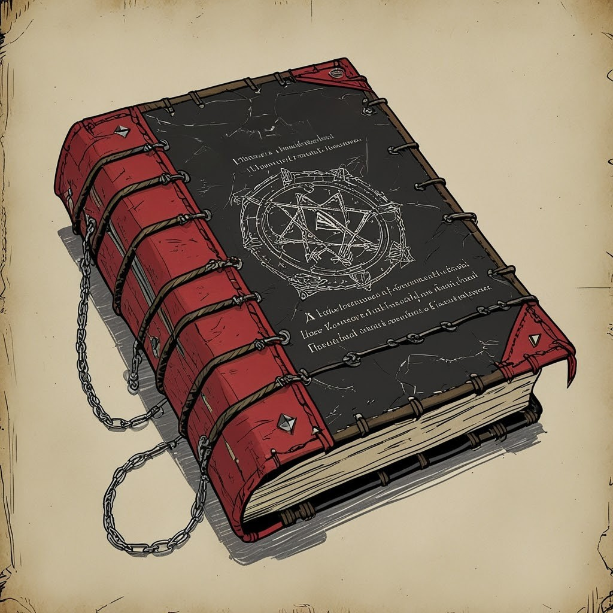

# Umbroscriptorium

- *"I swear it! That's what I heard, I'll you the book can speak! It told me to read it..."*

- *“A book might contain poetry, historical accounts, information pertaining to a particular field of lore, diagrams and notes on gnomish contraptions, or just about anything else that can be represented using text or pictures.”*

This book is no different. Or maybe just slightly so. 

This notebook has the appearance of a tattered weighty tome, bound in humanoid hide of various origins stitched together and studded with steel.

A Book of Shadows is granted to a Warlock upon entering a Pact of The Tome with their Patron.
This Book of Shadows fulfills at the same time the function of Book of Ancients Secrets, an enhancement, which zealous adepts can gain thanks to their careful study of the Eldritch Invocations. 

This shadowy Tome of dark knowledge is known as an Umbroscriptorium in Akta's tradition. And as is her habit regarding her possessions, she named her ledger Notebookomicon.
Essentially written in Infernal, with some passages in Abyssal, this book is Akta’s most trusted companion as well as her memory and her legacy. This is where spells and experiments are documented. This is also where she keeps her travel log as well as a wealth of dark lore and other information she wants to keep handy.
Akta has the intention of enhancing her inseparable codex, with time, into a true Librum Necronomica. Currently, it's admittedly still closer to a Necrono' Tbook in terms of power and content.

---
# [Training Programm](drafts/Training%20Programm.md)
---
# [Published Umbroscriptorium](https://github.com/K0Je/Notebookomicon)

## [Akta's Char Sheet](Akta's%20Char%20Sheet.md)
## [Akta's Backstory](Akta's%20Backstory.md)
## [Akta's Chronicles](Akta's%20Chronicles.md)
## [Acts and Deeds](Acts%20and%20Deeds.md)
## [Insanity and Nightmares](Insanity%20and%20Nightmares.md)
## [Omens](Omens.md)
## [Last Words](Last%20Words.md)
## [Compendium of People & Creatures](Compendium%20of%20People%20&%20Creatures.md)
## [Varkolak & Mastema](../Notebookomicon-WIP/Varkolak%20&%20Mastema.md)
## [Ophidia](Ophidia.md)
## [Project Zanpakay](drafts/Project%20Zanpakay.md)
## [SAUMA - The NPC Project](drafts/SAUMA%20-%20The%20NPC%20Project.md)

---
---
---
# [Wiki Krish](https://publish.obsidian.md/dndatzwahle/Pirate-Campaign)

----

